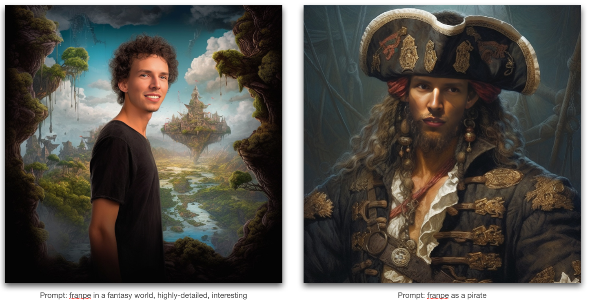
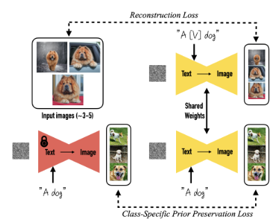

# Stable Diffusion Dreambooth

This repo contains code for training and inference of a fine-tuned stable diffusion model using dreambooth.

The repo is based on TheLastBen's implementation: https://github.com/TheLastBen/fast-stable-diffusion.

The code ran on a V100 GPU with 32 GB memory on Google Colab.

## Results

## Dreambooth

The [DreamBooth](https://arxiv.org/abs/2208.12242) approach focuses on personalizing text-to-image diffusion models. By providing a few images of a specific subject, the pretrained model is fine-tuned to associate a unique identifier with that subject. This allows the model to generate novel photorealistic images of the subject in different scenes and contexts. The approach leverages a semantic prior embedded in the model and introduces a new autogenous class-specific prior preservation loss. This enables the synthesis of subjects in diverse poses, views, and lighting conditions that are not present in the reference images.

